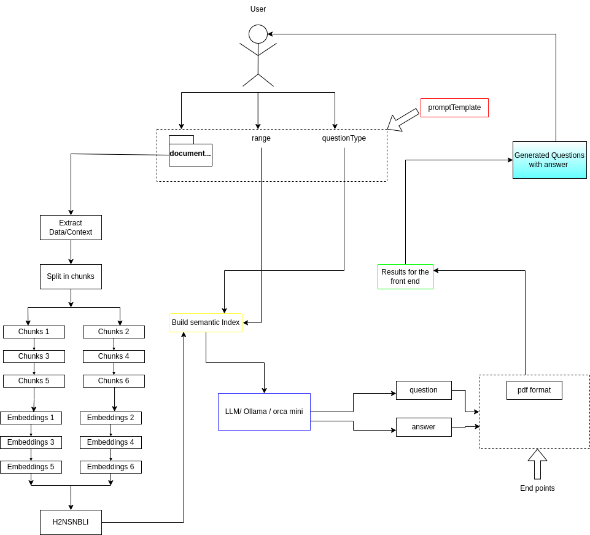

# Question Quest Backend

Welcome to the backend repository for Question Quest - Your Personalized Exam Practice Companion.

## Table of Contents

- [Overview](#overview)
- [Technologies Used](#technologies-used)
- [Getting Started](#getting-started)
- [API Endpoints](#api-endpoints)
- [Contributing](#contributing)
- [License](#license)

## Overview

This repository contains the backend code for Question Quest, a platform that provides personalized exam practice experiences to users. The backend is responsible for handling user requests, generating practice questions from uploaded PDF materials, and providing relevant data to the front-end application.

##### this is the logic we performed to accomplish the API



## Technologies Used

- Node.js: The backend is built using Node.js, a JavaScript runtime.
- Express.js: We use Express.js as the web application framework for building RESTful APIs.
- [Other Dependencies]: List any other significant technologies or libraries used in your backend here.(!!!)

## Getting Started

To set up and run the Question Quest Backend on your local machine, follow these steps:

### Prerequisites

Make sure you have the following installed:

- [Node.js](https://nodejs.org/)
- [npm](https://www.npmjs.com/) (usually comes with Node.js)

### Installation

1. Clone the repository:

   ```bash
   git clone https://github.com/your-username/QUESTION-QUEST-BACKEND.git
   ```

2. Navigate to the project directory:

   ```bash
   cd QUESTION-QUEST-BACKEND
   ```

3. Install project dependencies:

   ```bash
   npm install
   ```

4. Configure Environment Variables: If your backend requires any environment variables (e.g., database connection strings, API keys), create a `.env` file and add the necessary configurations.

5. Start the backend server:

   ```bash
   npm start
   ```

Your backend server should now be running and ready to accept requests from the Question Quest front-end application.

## API Endpoints

Document your API endpoints and their functionalities here. Provide examples of how to use them.

### Example Endpoint:

- **GET /api/question/:id**
  - Description: Retrieve a specific practice question by ID.
  - Request: `GET /api/question/123`
  - Response: `{ "id": 123, "question": "Sample question", "answer": "Sample answer" }`

[Add more endpoints and descriptions as needed.]

## Contributing

If you'd like to contribute to the development of the Question Quest Backend, please read the [Contributing Guidelines](CONTRIBUTING.md) for more information on how to get started.

## License

This project is licensed under the [MIT License](LICENSE).
